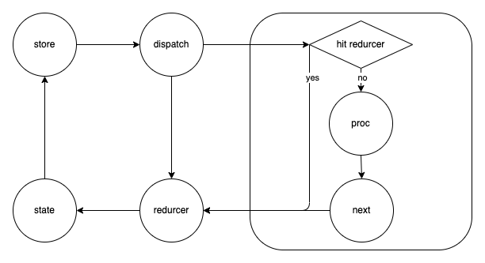

# DEBUGGER FOR REDUX_SAGA

## 前言

本文的目的是让大家了解 redux-saga 源码的主流程，适合有一定 redux-saga 使用经验的人阅读，主要分为 4 个部分

- [为什么诞生](#为什么诞生)
- [主流程](#主流程)
- [工具函数](#工具函数)
- [思考](#思考)
- [FAQ](#faq)

**注意事项：为了便于读者理解，源码只会截取部分，如果想要进一步了解，可在[此仓库](https://github.com/ImDaret/reduxSaga-debugger)的 index.html 中自行 debugger**

## 为什么诞生

redux 中 reducer 要求是一个纯函数，但是像异步获取数据，访问浏览器缓存这些副作用没法管理，所以诞生了 redux-saga

## 主流程

要使用 saga 首先要在 redux 中注册 saga 中间件。并且 调用它的 run 方法注册 rootSaga

```js
const sagaMiddleware = createSagaMiddleware();
applyMiddleware(sagaMiddleware);
sagaMiddleware.run(rootSaga);
```

对应的`createSagaMiddleware`返回值如下：

```js
function sagaMiddleware({ getState, dispatch }) {
  return (next) => (action) => {
    // 命中reducers
    const result = next(action);
    // 往channel中put一个action
    channel.put(action);
    return result;
  };
}
```

根据以上代码可知，外部触发一个 action 之后，如果 reducers 中匹配到对应的 action 则执行下一个中间件，否则往 channel 中 put 此 action，所以我们可以猜测，put 类似于 dispatch，真相如何让我们来一窥究竟

```js
put(input) {
	const takers = (currentTakers = nextTakers)

	for (let i = 0, len = takers.length; i < len; i++) {
		const taker = takers[i]

		// 如果命中，执行taker
		if (taker[MATCH](input)) {
				taker.cancel()
				taker(input)
		}
	}
}
```

已知 put 一个 action 会首先从 takers（也就是 nextTakers） 中找到与之匹配的 taker 并执行它，那么新的问题又来了，是什么时候往 nextTakers 中赋值的呢？我们可以大胆猜测一下，一定是`sagaMiddleware.run(rootSaga)`这段代码，只有在全局注册好，才能在任意 put 触发的时候匹配上，我们可以来看一下

```js
sagaMiddleware.run = (...args) => {
  return boundRunSaga(...args);
};
```

boundRunSaga 其实就是对应源码中的 runSaga,其主要作用是把 rootSaga 转化成 iterator 变量，然后传入 proc 函数中并调用

```js
export function runSaga(
  {
    channel = stdChannel(),
    dispatch,
    getState,
    context = {},
    sagaMonitor,
    effectMiddlewares,
    onError = logError,
  },
  saga,
  ...args
) {
  // 把rootSaga转换成iterator
  const iterator = saga(...args);

  const env = {
    channel,
    dispatch: wrapSagaDispatch(dispatch),
    getState,
    sagaMonitor,
    onError,
    finalizeRunEffect,
  };

  return immediately(() => {
    // 传入proc中
    const task = proc(
      env,
      iterator,
      context,
      effectId,
      getMetaInfo(saga),
      /* isRoot */ true,
      undefined
    );

    return task;
  });
}
```

proc 相当于是事件处理器，每次进来都会调用 next(),而 next 中会计算 iterator.next()的结果也就是后面提到的 effect,传入并调用 digestEffect，digestEffect 会调用 runEffect,runEffect 会从 effectRunnerMap 中找到匹配的 effect.type, 假如 type 是 TAKE，就执行对应的 runTakeEffect 方法，所以这里就是明明 effect 是个对象，但是回调也会发生的关键。

```js
export default function proc(
  env,
  iterator,
  parentContext,
  parentEffectId,
  meta,
  isRoot,
  cont
) {
  // 启动一个新的task
  const task = newTask(
    env,
    mainTask,
    parentContext,
    parentEffectId,
    meta,
    isRoot,
    cont
  );

  // 最终调用的Effect,在digestEffect中会被调用，一般来说可以理解就是调用了runEffect
  const finalRunEffect = env.finalizeRunEffect(runEffect);

  // 核心
  next();

  return task;

  // iterator的发动机
  function next(arg, isErr) {
    try {
      let result;
      if (isErr) {
        // 错误的情况
      } else if (shouldCancel(arg)) {
        // 取消的情况
      } else if (shouldTerminate(arg)) {
        // 终止的情况
      } else {
        // 正常情况，
        result = iterator.next(arg);
      }

      if (!result.done) {
        // iterator没有结束，就把next()结果传入digestEffect
        digestEffect(result.value, parentEffectId, next);
      } else {
        // 结束的情况就把status标记为DONE
        if (mainTask.status !== CANCELLED) {
          mainTask.status = DONE;
        }
        mainTask.cont(result.value);
      }
    } catch (error) {
      // 捕获到错误的情况
      if (mainTask.status === CANCELLED) {
        throw error;
      }
      mainTask.status = ABORTED;

      mainTask.cont(error, true);
    }
  }

  function runEffect(effect, effectId, currCb) {
    if (is.promise(effect)) {
      // effect是promise的情况
      resolvePromise(effect, currCb);
    } else if (is.iterator(effect)) {
      // effect是个iterator的情况，继续交给proc处理，启动一个新的task
      proc(
        env,
        effect,
        task.context,
        effectId,
        meta,
        /* isRoot */ false,
        currCb
      );
    } else if (effect && effect[IO]) {
      // 从effectRunnerMap找到对应的effectRunner，比如当effect.type为TAKE时，会执行runTakeEffect
      const effectRunner = effectRunnerMap[effect.type];
      effectRunner(env, effect.payload, currCb, executingContext);
    } else {
      // 其他的情况，结束
      currCb(effect);
    }
  }

  function digestEffect(effect, parentEffectId, cb, label = "") {
    function currCb(res, isErr) {
      // 结束的回调
    }

    // 其实就是调用了runEffect
    finalRunEffect(effect, effectId, currCb);
  }
}
```

runTakeEffect 会执行 channel.take，往 nextTakers 中赋值，这样以后对应的 put 触发时就能捕捉到了

```js
function runTakeEffect(env, { channel = env.channel, pattern, maybe }, cb) {
  // cb其实就是上文的currcb，是结束的回调
  const takeCb = (input) => {
    if (input instanceof Error) {
      // 错误的结束
      cb(input, true);
      return;
    }
    if (isEnd(input) && !maybe) {
      // 终止的结束
      cb(TERMINATE);
      return;
    }
    // 正常结束
    cb(input);
  };
  try {
    // 调用channel.take方法，往nextTakers中赋值，这样就能匹配后续与之对应的put了
    channel.take(takeCb, is.notUndef(pattern) ? matcher(pattern) : null);
  } catch (err) {
    // 错误的结束
    cb(err, true);
    return;
  }
  cb.cancel = takeCb.cancel;
}
```

至此我们完成了简单的闭环，让我们来画一张流程图加深一下理解

[](https://github.com/ImDaret/ReduxSaga-debugger/blob/main/imgs/sagaProcess.png)

## 工具函数

高阶函数：返回只能调用一次的函数

```js
function once(fn) {
  let called = false;
  return () => {
    if (called) {
      return;
    }
    called = true;
    fn();
  };
}
```

## 思考

不同于 redux-thunk，可以把 redux-saga 看作一个独立的线程，在这个线程里面既可以获取 redux 中的 state，也可以 dispatch 一个 action，而且它更利于测试，也不会造成回调地狱。saga 的设计精妙之处在于利用了 generator 的特性（next 完了之后可以交由外部控制），把所有的 effect 都对应成一个对象，然后由 proc 去处理，这也是它的核心竞争力所在，用户可以精确地控制每一步对应的操作，而且还额外提供了很多 effect 方法和辅助函数。

## FAQ

### 1. call 辅助函数在源码中只是返回了一个对象，它的执行机制是怎样的

redux-saga 要求注册的 saga 回调都是 generator 函数，所以当发生一个 channel.put 时，就会进入一个 generator 环境，yield call(xxx)返回一个 effect 对象，然后将它交由在上文提到的 proc 中匹配到对应的 effectRunner 并执行它

### 2. 相比于 call，fork 是怎么不阻塞 generator 协程调用的

runCallEffect，当回调是个 promise 时会等 promise 执行完毕再 next(),当时一个 generator 时会调用 proc 开启一个新的 task，等 task 执行完成才会 next()

runForkEffect，直接调用 proc 开启一个新的 task，并且直接 next()进入下一步

**tip: next 对应源码中的 cb**
